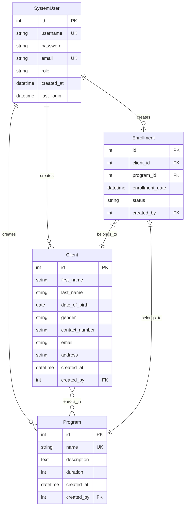

# AfyaLink Database Schema

## Entity Relationship Diagram

## Relationships

1. **SystemUser to Client**
   - One-to-Many relationship
   - A system user can create multiple clients
   - Each client is created by one system user

2. **SystemUser to Program**
   - One-to-Many relationship
   - A system user can create multiple programs
   - Each program is created by one system user

3. **SystemUser to Enrollment**
   - One-to-Many relationship
   - A system user can create multiple enrollments
   - Each enrollment is created by one system user

4. **Client to Program**
   - Many-to-Many relationship through Enrollment
   - A client can be enrolled in multiple programs
   - A program can have multiple enrolled clients

5. **Enrollment to Client**
   - Many-to-One relationship
   - Each enrollment belongs to one client
   - A client can have multiple enrollments

6. **Enrollment to Program**
   - Many-to-One relationship
   - Each enrollment belongs to one program
   - A program can have multiple enrollments

## Constraints

1. **Unique Constraints**
   - SystemUser.username must be unique
   - SystemUser.email must be unique
   - Program.name must be unique
   - Enrollment(client_id, program_id) must be unique (a client can only be enrolled once in a program)

2. **Required Fields**
   - SystemUser: username, password, email, role
   - Client: first_name, last_name, date_of_birth, gender
   - Program: name, duration
   - Enrollment: client_id, program_id

3. **Default Values**
   - SystemUser.role defaults to 'doctor'
   - Program.duration defaults to 30 days
   - Enrollment.status defaults to 'Active'
   - created_at fields default to current UTC timestamp 